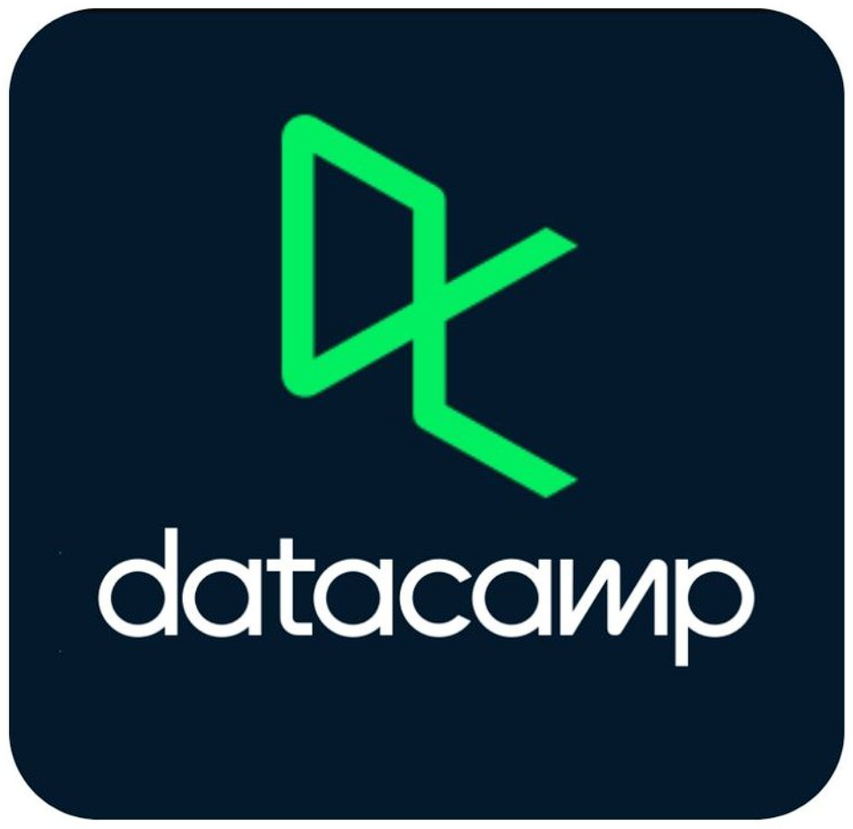
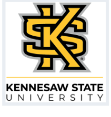
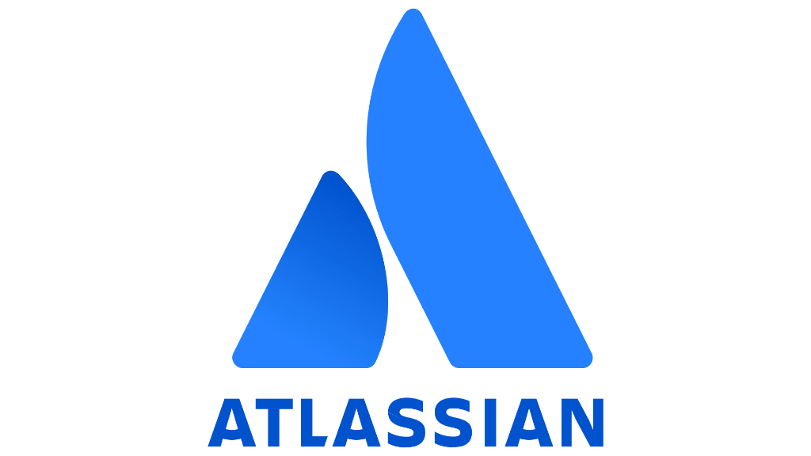

Anshul Silhare

* [About](#about)
* [Experience](#experience)
* [Expertise](#stack)
* [Projects](#projects)
* [Certifications](#certs)
* [Education](#education)
* [Leadership](#leadership)
* [Contact](#contact)

Theme

Open to Opportunities · Operations, Supply Chain & Analytics

# Anshul Silhare.

Helping businesses make better operational decisions through data.

PGDM Research & Business Analytics · WeSchool Mumbai '27 · Operations | Supply Chain | Analytics

[LinkedIn](https://linkedin.com/in/anshul-silhare)
 [GitHub](https://github.com/AnshulSilhare)
 Share
[View Projects ↓](#projects)

0

Portfolio Projects

0.00

PGDM GPA

scroll

01 · About

## A bit about me.

Anshul Silhare

Operations & Analytics · WeSchool Mumbai

📍Mumbai, Maharashtra

✉️anshulsilhare@gmail.com

[linkedin.com/in/anshul-silhare](https://linkedin.com/in/anshul-silhare)

[github.com/AnshulSilhare](https://github.com/AnshulSilhare)

🎓PGDM Research & Business Analytics '27 · GPA 8.69

🏢Supply Chain Analytics Intern @ Nerolac Nerofix Pvt Ltd

PGDM student focused on Operations Management
and Business Analytics.

I am a **PGDM candidate at WeSchool Mumbai** specializing in Operations Management and Business Analytics. I bridge the gap between hands-on data analytics and executive decision-making, applying SQL, Python, Power BI, and core Operations and Supply Chain frameworks to solve real operational bottlenecks.

During my Supply Chain Analytics internship at **Nerolac Nerofix**, I delivered three management-approved projects focused on stockout risk mitigation, secondary sales dealer clustering, and distributor dispatch SLAs. Whether building FMCG demand forecasting engines or predictive delay classifiers, I build tools that turn complex data into clear, **data-driven decisions** and measurable revenue protection.

My approach of treating every operational challenge like a testable hypothesis stems from my **BSc in Biotechnology**, where I learned that data beats assumptions. Today, I combine that scientific rigor with **Lean Six Sigma** methodologies to help business operations and supply chains run leaner, faster, and more resilient.

SQL · Advanced
Python · Modeling
Power BI · DAX
Supply Chain
Lean Six Sigma
Odoo ERP

02 · Experience

## Professional Experience.

Completed Internship Project

Completed

Nerolac Nerofix: Logistics Benchmarking & Inventory Optimization

Supply Chain Analytics Intern  ·  Kansai Nerolac Nerofix Pvt. Ltd.

May 2026 - July 2026 · 2 Months

Supply Chain Analytics
Python
Power BI
SQL Server
Transporter Scorecard
Inventory Optimisation
Safety Stock
VBA

Led two end-to-end supply chain optimization initiatives across Kansai Nerolac Nerofix's **7-depot national distribution network**. Built a **composite carrier scorecard** evaluating **66 freight transporters across 8,450+ dispatches** to resolve SLA bottlenecks and drive route-level carrier reallocations via a **3-page Power BI dashboard** and **operational Excel sheets**. Simultaneously engineered a multi-depot replenishment pipeline for **450+ SKUs**, establishing **ABC-FSN classifications** and **dynamic Safety Stock/ROP models** based on factory lead-time matrices. Delivered automated operational tools in **macro-enabled Excel (VBA)**, with all frameworks **approved by executive leadership for network-wide deployment**.

8,450+
Shipments Analyzed

66 Carriers
Log-Scaled Scorecard

450+ SKUs
7-Depot ROP & Safety Stock

Approved
Cleared for Network Rollout

View Case Study & Anonymized Dashboards | Enterprise Data Anonymized

03 · Expertise

## Skills & Capabilities.

Technical Stack & Software

⚙

Data & Querying

SQL (T-SQL, MySQL)

Advanced Excel

Python for Analytics

pandas
numpy
scikit-learn
matplotlib
seaborn

📊

BI & Visual Analytics

Power BI · DAX & Power Query

Data Modeling · Star / Snowflake

Tableau · Visual Analytics

Domain Frameworks & Methodologies

🏭

Supply Chain & Operations

Inventory Optimization · Safety Stock & ROP

Logistics Benchmarking & Route Analysis

Sourcing, Planning & Procurement

Odoo ERP · Inventory, Sales & Purchasing

📈

Quality, Strategy & AI

Lean Six Sigma · DMAIC Methodology

Statistical Process Control (SPC)

Generative AI & Prompt Engineering

Agile Project Management · Jira

04 · Portfolio

## Featured Projects.

01⚡ Enterprise SC Engine

Production Ready

DemandSense AI: Indian FMCG
Multi-Echelon Demand & Inventory Engine

Auto-ML Forecasting | Prescriptive LLM Agent | Indian Seasonality | Safety Stock Sizing | What-If Price Elasticity | Streamlit & Plotly

Enterprise-grade demand sensing and inventory planning engine built for Indian FMCG supply chains. Automates multi-model forecasting & benchmarking (XGBoost, Prophet, SARIMAX, Holt-Winters) to eliminate stockouts during festive peaks (Diwali, Holi), dynamically size safety stocks across 90%-98% service level SLAs, and simulate lead-time disruptions to protect working capital.

₹1.8 Cr+
Revenue at Risk Protected

95.2%
Forecast Accuracy (MAPE < 5%)

-28%
Excess Inventory Holding Cost

5 Regional Hubs
20 SKUs · 109K+ Records

▶
Under the Hood
3 Supply Chain Challenges Solved

01
5-Model Auto-ML Selection Arena
Eliminates planner bias by running parallel backtesting across 5 statistical and ML models (XGBoost, Prophet with Indian Holiday Regressors, SARIMAX, Holt-Winters, 14d WMA). Automatically deploys the lowest-MAPE algorithm per SKU-region echelon over 60-day unseen test sets.

02
Indian Market Intelligence & Luni-Solar Festival Elasticity
Decomposes baseline trend from volatile Indian calendar shifts (Diwali +180% surge, Holi, Navratri, Eid, Ganesh Chaturthi, Pongal), monsoon spikes, and salary cycle effects (+8% lift on 25th-5th), preventing stockouts during peak retail windows.

03
Prescriptive LLM Agent & What-If Price Elasticity
Combines Google Gemini API (with offline rule-engine fallback) to generate executive procurement briefs with real-time what-if simulations modeling price elasticity feedback loops and supply lead-time disruptions to safeguard working capital.

02🤖 ML / AI

Complete

DataCo Supply Chain:
AI Delivery Risk Predictor

Machine LearningRandom ForestGradioHF SpacesPythonScikit-Learn

End-to-end ML web application predicting supply chain delivery delays before they happen using a Random Forest Classifier. Outputs a probability risk score with Explainable AI feature importance, plus bulk CSV processing for 500+ orders at once.

180K+

Records Trained On

80%

Precision Score

240+

Engineered Features

Real-time + Bulk

Prediction Modes

▶
Under the Hood
3 challenges solved

01

Matrix Dimensionality Fix

Model trained on 240+ One-Hot Encoded columns, UI takes 4 inputs. Solved via `model.feature_names_in_` generating a zero-filled skeleton matrix and mapping inputs to correct indices.

02

Self-Healing Scaler

Isolates numerical columns via `scaler.feature_names_in_`, scales only those, then re-stitches the dataframe, preventing shape mismatch errors during inference.

03

Model Size Optimisation

Rebuilt a 749MB overfit model using `max_depth=25, min_samples_leaf=3`, reducing size to 22MB while retaining 80% precision on late delivery detection.

Hosted on Hugging Face Spaces · loads instantly in-page

[GitHub](https://github.com/AnshulSilhare/ai-dataco-supply-chain)
🚀 Live Demo

02Complete

Rapido Logistics: Revenue Leakage & Loss Analytics

SQLPower BI (3 Views)Database DesignDAX AnalyticsRevenue Audit

Designed an operational MySQL database backend with 8 normalized entities and built an interactive 3-perspective Power BI dashboard with 13 custom DAX measures. Analyzed 30,000 bookings to identify ₹251.9K in revenue leakage and flagged a 20% lead time spike in night shifts.

30K+

Bookings Analyzed

₹251.9K

Leakage Identified

20%

Night Shift TAT Lag

8 Entities

Star Schema (3NF)

[GitHub](https://github.com/AnshulSilhare/Rapido_Logistics_Analytics_SQL)
See Details →

03Complete

Amazon Logistics Network Optimisation

Network DesignOperations ResearchExcel SolverPython Folium

Engineered a hub-and-spoke network digital twin consolidating 15 nodes into 5 regional distribution centers. Validated geodesic transit routes, reaching 94% customer coverage in <48hr.

5-Node

Hub-and-Spoke model

94%

Population Coverage

249 km

Avg Delivery Radius

-18%

Fuel Consumption

[GitHub](https://github.com/AnshulSilhare/Logistics-Network-Optimization)
🗺️ Map
See Details →

04Complete

Pharma Demand Forecasting: Model Selection

Advanced ExcelStatistical ModelingSupply Chain Planning

Segmented product portfolio by coefficient of demand variation. Applied Exponential Smoothing (α=0.5) to volatile SKUs and Moving Average to stable lines to optimize safety stocks.

SKU Profiling

Volatility vs Stability

Exp. Smoothing

Volatile Model (α=0.5)

Moving Avg

Stable Model

↓ Expiry

Waste & Stockout Mitigation

[GitHub](https://github.com/AnshulSilhare/Pharma-Demand-Forecasting)
See Details →

05Complete

SQL Data Warehouse: Medallion Architecture

SQL ServerETL PipelineStar SchemaData Modeling

Production-grade enterprise data warehouse on SQL Server. Ingests raw data from ERP and CRM systems, processes through Bronze, Silver, and Gold medallion layers, and serves business-ready dimensional models for analytical reporting.

3-Layer

Medallion Architecture

Star Schema

Fact + 2 Dim Tables

ERP + CRM

Source Systems

Pure T-SQL

No third-party ETL

[GitHub](https://github.com/AnshulSilhare/sql-data-warehouse-project)
See Details →

06Complete

Data Analyst Job Market Analysis: Python

PythonpandasmatplotlibseabornCareer Analytics

Analyzed 100,000+ real US job postings to identify what skills employers actually require. 5 Jupyter notebooks covering skill demand, salary by skill, degree requirements, and optimal skills.

100K+

Job Postings

51%

SQL Demand Rate

72%

Jobs w/o Degree Req.

$98K

Python Median Salary

[GitHub](https://github.com/AnshulSilhare/us-data-jobs-analysis)
🚀 Demo
See Details →

07Complete

Warehouse Layout Optimization: Flow Engineering

Lean OperationsFacility DesignZoningProcess Flow

Redesigned a traditional warehouse floor plan using Lean principles. Separated Inbound/Outbound zones and mapped high-turnover SKUs closer to packing lanes to eliminate layout overlaps.

Zoning

Inbound / Outbound Docks

ABC Analysis

SKU Velocity slotting

Segregated

Forklift & Pedestrian lanes

Throughput

Picking Cycle Optimization

[GitHub](https://github.com/AnshulSilhare/Warehouse-Layout-Optimization)
See Details →

08Complete

Medical Device Supply Chain: Value Stream Mapping

Value Stream MappingProcess DesignSwimlane ChartsLogistics

Mapped the medical device logistics flow in Lucidchart. Exposed a 96-hour process delay at off-site sterilization providers and modeled a solution to resolve sales rep "Trunk Stock" blind spots.

Trunk Stock

Rep Car Inventory Audit

96+ Hours

Sterilization Process Lag

Swimlane

Lucidchart Visual Mapping

↓ Capital

Working Capital Efficiency

[GitHub](https://github.com/AnshulSilhare/Value-Stream-Mapping)
See Details →

09Complete

Consumer Behavior: The Personalization Paradox

Business AnalyticsSPSSQuantitative ResearchCorrelation

Conducted quantitative study (N=130) analyzing personalization algorithms vs. privacy concerns in Beauty/Wellness. Computed Spearman's correlation (r=0.68) for trust vs. repurchasing in SPSS.

N=130

Survey Respondents

r = 0.68

Trust vs Repurchase (SPSS)

r = -0.47

Privacy vs Data Share

Spearman

Correlation Testing

[GitHub](https://github.com/AnshulSilhare/Consumer-Behavior-Research)
See Details →

05 · Credentials

## Credentials & Certifications.

Google
4 certifications

Google Advanced Data Analytics Professional Certificate In Progress

Google · Professional Certificate

5 of 7 courses complete

Foundations of Data Science

Go Beyond Numbers: Translate Data into Insights

Power of Statistics

Regression Analysis

The Nuts and Bolts of Machine Learning

[Verify Progress](https://www.coursera.org/account/accomplishments/verify/Y8AD29C80P4N)
Preview

DataCamp
2 certifications

Introduction to Python

DataCamp · Statement of Accomplishment

Feb 2026 · 4 hrs

Verify
 Preview

Intermediate Python

DataCamp · Statement of Accomplishment

Feb 2026 · 4 hrs

Verify
 Preview

Microsoft
5 certifications

Data Analysis & Visualization with Power BI

[Verify](https://www.coursera.org/account/accomplishments/verify/54FEPJMDCYZF)
 Preview

Data Modeling in Power BI

[Verify](https://www.coursera.org/account/accomplishments/verify/EOZJIYQVDK8D)
 Preview

Harnessing the Power of Data with Power BI

Verify
 Preview

SQL Foundations

[Verify](https://www.coursera.org/account/accomplishments/verify/VWEODRPLHHS6)
 Preview

Preparing Data for Analysis with Microsoft Excel

[Verify](https://www.coursera.org/account/accomplishments/verify/CAZ581C2Z2TM)
 Preview

Kennesaw State University
1 certification

Six Sigma Green Belt Specialization

Kennesaw State University · 4-course specialization

Aug 2026

[Verify Specialisation](https://coursera.org/verify/specialization/50P178BG7Q7X)
Preview

Rutgers University
2 certifications

Supply Chain Management Specialization

Rutgers University · 5-course specialization

Dec 2025

Supply Chain Management Strategy

Supply Chain Sourcing

Supply Chain Planning

Supply Chain Operations

Supply Chain Logistics

[Verify Specialisation](https://www.coursera.org/account/accomplishments/specialization/GWM4JGQWOI2B)
Preview

Supply Chain Analytics Specialization

Rutgers University · 6-course specialization

Aug 2026

Supply Chain Analytics Essentials

Business Intelligence and Competitive Analysis

Demand Analytics

Inventory Analytics

Supply Chain Analytics

Sourcing Analytics

[Verify Specialisation](https://www.coursera.org/specializations/supply-chain-analytics)
Preview

Vanderbilt University
4 certifications

Generative AI Leadership & Strategy Specialization

Vanderbilt University · 3-course specialization

Aug 2026

[Verify Specialisation](https://coursera.org/verify/specialization/5E2H4DJ7MW3Z)
Preview

Generative AI for Leaders

Aug 2026

[Verify](https://www.coursera.org/account/accomplishments/verify/414IN9TWBPEW)
Preview

Prompt Engineering for ChatGPT

Aug 2026

[Verify](https://coursera.org/verify/OQVKDV7AWOP8)
Preview

Trustworthy Generative AI

Aug 2026

[Verify](https://coursera.org/verify/584XPHAKDHY5)
Preview

University of California, Davis
2 certifications

Essential Design Principles for Tableau

[Verify](https://www.coursera.org/account/accomplishments/verify/YY8BY187SXMU)
 Preview

Fundamentals of Visualization with Tableau

[Verify](https://www.coursera.org/account/accomplishments/verify/AXBPYIJAX6VC)
 Preview

+

Other Institutions
4 certifications

Foundations of Business Strategy

[Verify](https://coursera.org/verify/HTL4ZI37EG2Z)
 Preview

Microsoft Excel - Excel from Beginner to Advanced
Kyle Pew, Office Newb · Udemy

[Verify](https://ude.my/UC-4914def4-8e1d-4e71-b454-90307aa4ab5b)
 Preview

EA Product Management Simulation

Verify
 Preview

Jira Fundamentals

Verify
 Preview

In Progress
1 remaining

Google Advanced Data Analytics: Courses 4–7 In Progress

Google

06 · Education

## Academic Background.

2027

PGDM in Research & Business Analytics

WeSchool (Welingkar Institute of Management) · Mumbai

GPA 8.69Specialisation: Operations ManagementOngoing

2025

BSc Biotechnology

Hislop College, Nagpur (RTMNU)

70.74%Foundation in research and analytical thinking

2020

Class XII · CBSE

Krishna Public School, Bhilai

84%Science Stream

2018

Class X · CBSE

Krishna Public School, Bhilai

90.33%

07 · Leadership & Responsibilities

## Leadership & Responsibilities.

Management Committee · Analytics Round Table Conference

WeSchool Mumbai · 2025-2027

Core Management Committee member for the Analytics Round Table Conference at WeSchool; active student volunteer driving operational and logistical coordination across various institutional events.

Management Committee · Science Society

Hislop College, Nagpur · 2023-2025

Led cross-functional initiatives across 2 years, driving process planning, operational coordination, and project tracking for inter-collegiate science events.

Management Committee

Golden Hour Organisation

Coordinated multi-team student initiatives supporting 100+ orphaned children, managing planning, execution, and delivery tracking.

Community Contributor

Positivity XO

Supported child-focused community programs, demonstrating social responsibility and cross-team collaboration for weekly outreach initiatives.

## Open to full-time roles & opportunities.

Targeting roles in Operations Analytics, Supply Chain Analytics, and Data & Business Analytics. Completed internship at Kansai Nerolac Nerofix, actively building toward my final placement.

✉
anshulsilhare@gmail.com
[linkedin.com/in/anshul-silhare](https://linkedin.com/in/anshul-silhare)
[github.com/AnshulSilhare](https://github.com/AnshulSilhare)

© 2026 Anshul Silhare · WeSchool Mumbai · PGDM Research & Business Analytics '27

Top
↑

Share

Live Demo: **Project**

Hugging Face Spaces
Open in new tab ↗
✕

⬡

Loading app…

Starting up…

Taking too long? Open directly ↗

×

Certificate Title